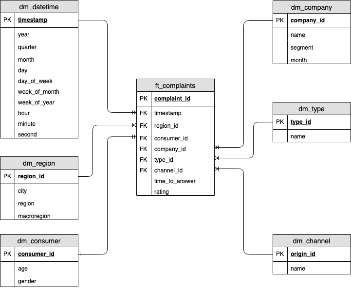

# Udacity Data Engineering Capstone Project

## Scope

Use data from Multiple sources to create an Analytics database that 
helps understanding the Brazilian pattern in consumer complains.  

## Datasets

- Consumidor.gov.br complains
- Procon (Brazilian consumer defence organism) complains
- Demographic information from Brazilian 2010 census (cities an states)
- Brazilian ZIP code information with cities and states

## Insights

- Origin of the complains (Procon, consumidor.gov, other)
- Where? (Region, City)
- Device used (Web, celphone, Personal)
- Demographic (age, gender)
- Companies
- Markets
- Complains / Habitants

## Data Model 

- ft_complaints (number, time_to_answer, grade)
- (?) ft_population
- dm_date
- dm_company (name, segment)
- dm_region (Macroregion, region, city)
- dm_consumer (age, gender)
- dm_type
- dm_channel



## Data Wrangling

- Check Data Type
- Convert to UTF-8
- Split in small csv files
- GZIP
- Upload to S3

## Data Pipeline

The data pipeline has two main DAGs, Procon DAG and Consumidorgovbr DAG,
responsible to get and do the wrangling in this datasets whenever there 
are new files on their S3 keys.

It is scheduled to run every hour a very reasonable amount of time to
check if someone manually have put a new file to the buckets. As 
these are Brazilian government datasets public available there is not
a right cadence they made new information available, so someone have to 
check it.   

## Docker Airflow Enviroment 

There are two containers, one running airflow, the other postgres.
Run Airflow container with docker-compose.

```commandline
$ docker-compose up -d
```

Stop the containers:

```commandline
$ docker-compose stop
```

To run Airflow commands on docker, for example testing a 
specific task, use:

```commandline
$ docker-compose run webserver airflow test <dag_id> <task_id> <start_date>
```

To use Airflow web interface, enter on http://localhost:8080/admin

## References

- [Dados consumidor.gov.br](http://dados.gov.br/dataset/reclamacoes-do-consumidor-gov-br1)
- [Dados atendimento de consumidores no Procon](http://dados.gov.br/dataset/atendimentos-de-consumidores-nos-procons-sindec1)
- [Dados de população do censo de 2010, cidades com mais de 50k habitantes](https://ww2.ibge.gov.br/home/estatistica/populacao/censo2010/sinopse/sinopse_tab_brasil_zip.shtm)
- [Dados cep](http://cepaberto.com)
- [Unidades dos Procons](http://dados.gov.br/dataset/unidades-dos-procons1)

## Tasks

- [x] Data Quality Check Operators!
- [ ] Analyze resulting DW
- [ ] Check for keys improvements
- [ ] Check for structural improvements (how data is distributed on redshift)
- [ ] Make every DW table and column name at the same pattern and 
    change data model schema image
- [ ] Import all CSVs
- [ ] Create a dashboard
