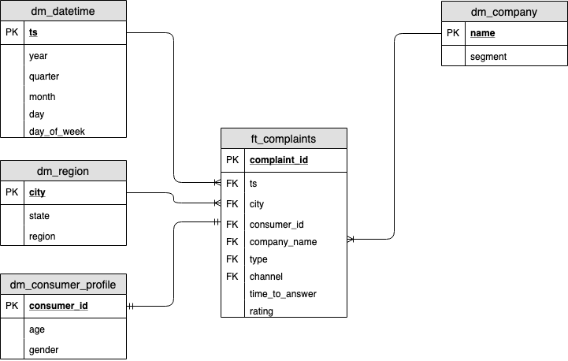

# Udacity Data Engineering Capstone Project - Brazilian Consumer Complaints

## Scope

Use data from Multiple sources to create an Analytics database that 
helps understanding the Brazilian pattern in consumer complains with 
a combination of the two most know ways brazilian consumers have 
to solve their problems:

The first one, Procon, is a government consumer defence organism 
available country wide, where you have to go in person or by phone to 
open a complaint against a company (we are going to call offline).

The second one, consumidor.gov.br, is a website where consumers can make 
complaints against companies, also made available by the Brazilian 
government.

## Datasets

- Consumidor.gov.br complains
- Procon (Brazilian consumer defence organism) complains
- Demographic information from Brazilian 2010 census (cities an states)
- Brazilian ZIP code information with cities, states and region

## Insights

With the datasets we want to be able to provide the following insights
about complaints in Brazil:

- Origin of the complains (Procon, consumidor.gov, other)
- Where do we have more complaints? (State, City, Region)
- Device used (Web, celphone, in person)
- Demographic (age, gender)
- Companies with most complaints

After the creation of the data pipeline we have answered this questions
on a jupyter notebook, located at "analysis/analysis-dw.ipynb"

## Data Wrangling

By exploring the original datasets using the jupyter notebooks located 
on the analysis folder, we understood that the data wrangling process
should include:

###  1 - For the consumidorgovbr dataset 

- Convert the original file to UTF-8 before hand
- No further data quality issues were find

### 2 - For the procon dataset

- This dataset does not have city and state information but we can
get this information from the field "cep_consumidor" that
contains the zipcode information, so we got a zipcode dataset
to make the equivalence.
- Age and gender information are consistent to the other dataset,
so there is no need to work on it

## Data Model 

After exploring the data and considering the insights we want to have 
over the datasets, we came to the following desired data model:



### ft_complaints

| Column         | Type        | Description                                                                                                           | Example                |
|----------------|-------------|-----------------------------------------------------------------------------------------------------------------------|------------------------|
| complaint_id   | int         | The unique identifier of the complaint line.                                                                          | 1                      |
| ts             | timestamptz | The date and time of the complaint. Also is a Foreign Key for dm_date.                                                | 2017-01-20 00:00:00+00 |
| city           | text        | The city where the author of the complaint lives. Also is a Foreign Key for dm_region.                                | São Paulo              |
| consumer_id    | int         | The id of the consumer profile. Also is a Foreign Key for dm_consumer_profile.                                        | 1                      |
| company_name   | text        | The city where the author of the complaint lives. Also is a Foreign Key for dm_company.                               | VIVO                   |
| type           | text        | The product or service that the complaint refer to.                                                                   | Telefonia              |
| channel        | text        | The channel where the complaint take place. Can be 'procon', 'Plataforma IOS', 'Plataforma Android', 'Plataforma Web' |  procon                |
| time_to_answer | int         | How long the company take to answer the complaint.                                                                    | 10                     |
| rating         | int         | The rating the consumer give to the company, from 1 to 5.                                                             | 1                       |

### dm_date

| Column      | Type        | Description                         | Example                |
|-------------|-------------|-------------------------------------|------------------------|
| ts          | timestamptz | The date and time of the complaint. | 2017-01-20 00:00:00+00 |
| year        | int         | The year from the ts.               | 2017                   |
| quarter     | int         | The quarter from the ts.            | 1                      |
| month       | int         | The month from the ts.              | 1                      |
| day         | int         | The day from the ts.                | 20                     |
| day_of_week | text        | The day of the week from the ts.    | 1                      |

### dm_region

| Column | Type | Description                              | Example   |
|--------|------|------------------------------------------|-----------|
| city   | text | The city name.                           | São Paulo |
| state  | text | State abbreviation of the city state.    | SP        |
| region | text | Region abbreviation of the state region. | SE        |

### dm_consumer_profile

| Column      | Type | Description                                                   | Example            |
|-------------|------|---------------------------------------------------------------|--------------------|
| consumer_id | int  | The id for the combination of age and gender of the consumer. | 1                  |
| age         | text | A range of age to the consumer profile.                       | entre 51 a 60 anos |
| gender      | text | The gender abbreviation of the consumer profile.              | M                  |

### dm_company

| Column  | Type | Description                | Example   |
|---------|------|----------------------------|-----------|
| name    | text | The name of the company.   | VIVO      |
| segment | text | The sector of the company. | Telefonia |

## Data Pipeline

To build the data pipeline we choose Apache Airflow, as it is a 
reliable and market leader solution to orchestrated data pipelines, 
and would fit into our goal to process data from csv files from S3 
and put it into a database, making the necessary wrangling.

For a database/warehouse solution we have picked Redshift as it allow 
a very structured data modeling that made analytics easy and can easily
work with the amount of data (~10M rows for the last 4 years). The
volume of data is not likely to increase to a pattern that we would need
a Bid Data solution as Spark.  

The data pipeline has two main DAGs, Procon DAG and Consumidorgovbr DAG,
responsible to get and do the wrangling in this datasets whenever there 
are new files on their S3 keys.

It is scheduled to run every hour to check if someone have put a new 
file to the buckets. As these are Brazilian government datasets public 
available there is not a right cadence they made new information 
available, so it is a very reasonable amount of time to check for 
new files.

## Addresing Other Scenarios

### 100x data increase

As we said, it is not likely the data increase to this level, but for
this amount of data we can summarize the data into some specific tables
for each of the questions, without having all complaints in the fact
table as we have.

To work with all that data  we could still keep the CSV files on S3
but use AWS EMR to work on it right from S3 with PySpark, making the
queries necessaries to the resulting summarized model.

### The pipeline would run on a daily basis

We can still use this pipeline if we receive information form the 
sources everyday, if it comes incrementally, if not we should change
the DAGs to filter just new complaints (this could be done on the 
staging level) based on the DAG running date.

### The database need to be accessed by 100+ people

Redshift is a very powerful database, so it can easily support 100+ 
people for the current volume of data. What could be done is check for
some structural improvements like keys and data distribution across 
the nodes, or even increasing the number of nodes or the instance
size.  

## Docker Airflow Enviroment 

There are two containers, one running airflow, the other postgres.
Run Airflow container with docker-compose.

```commandline
docker-compose up -d
```

Stop the containers:

```commandline
docker-compose stop
```

To run Airflow commands on docker, for example testing a 
specific task, use:

```commandline
docker-compose run webserver airflow test <dag_id> <task_id> <start_date>
```

To use Airflow web interface, enter on http://localhost:8080/admin

## References

- [Dados consumidor.gov.br](http://dados.gov.br/dataset/reclamacoes-do-consumidor-gov-br1)
- [Dados atendimento de consumidores no Procon](http://dados.gov.br/dataset/atendimentos-de-consumidores-nos-procons-sindec1)
- [Dados de população do censo de 2010, cidades com mais de 50k habitantes](https://ww2.ibge.gov.br/home/estatistica/populacao/censo2010/sinopse/sinopse_tab_brasil_zip.shtm)
- [Dados cep](http://cepaberto.com)

## Tasks

- [ ] Create a dashboard
